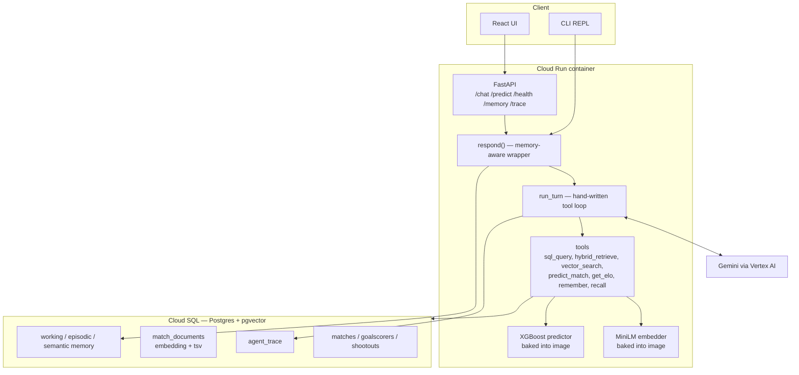
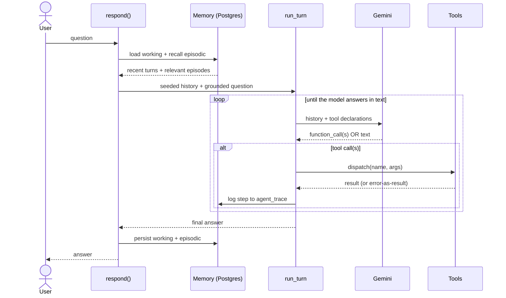
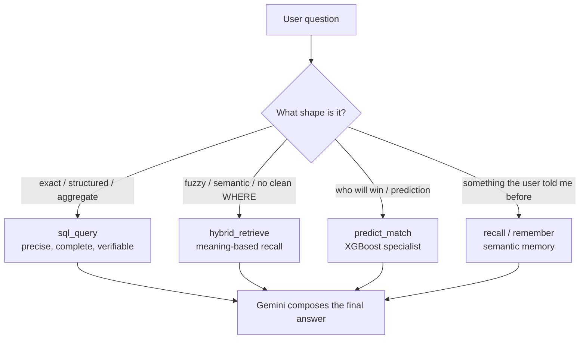
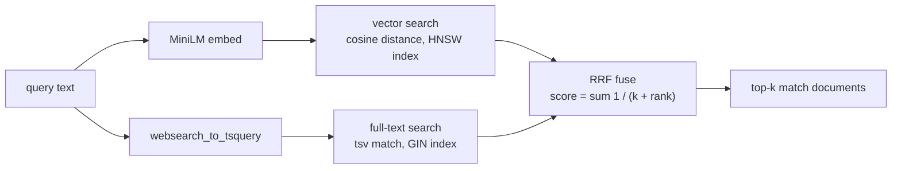
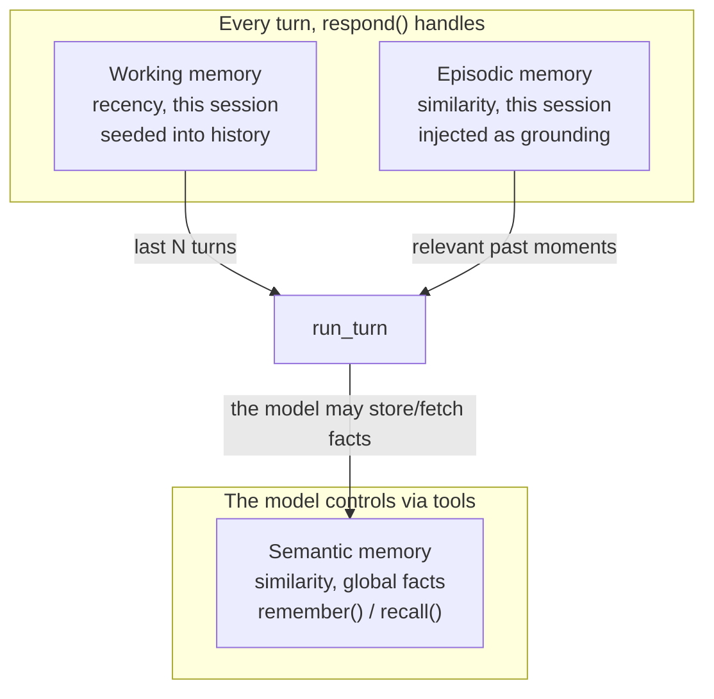

# Architecture (finished state)

How the agent works once all phases are complete. These diagrams describe the
*target* system (Phases 0–8), not necessarily what is implemented today — see
`../CONTEXT.md` for current status.

## 1. System overview

## 2. One turn, end to end

## 3. Which tool? (the model decides by question shape)

## 4. Hybrid retrieval internals (Phase 3)

## 5. Three-tier memory

